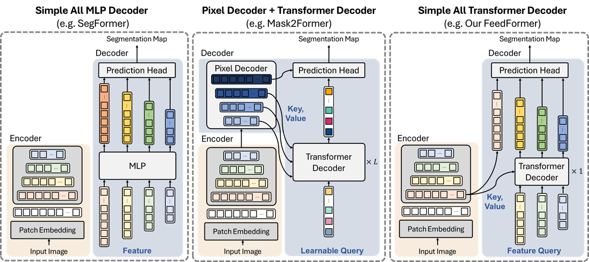

# FeedFormer: Revisiting Transformer Decoder for Efficient Semantic Segmentation

<!--  -->
<div align="center">
  
</div>
<p align="center">
  Figure 1: Main concept of FeedFormer.
</p>

We propose  the Feature Enhancing Decoder Transformer (FeedFormer), that enhances structual information using the transformer decoder. Our proposed model take advantage from both the simple ALL-MLP decoder, and the conventional transformer decoder structures in segmentation to design an efficient transformer decoder for semantic segmentation. Whereas conventional transformer decoders for segmentation, such as MaskFormer and Mask2Former, use additional learnable object query for the decoder, our model directly deploy the high-level features as queries and the lowest-level feature as the key and value. This enhances the high-evel features by collecting the structural information from the lowest-level feature. Additionally, we use a simple reformation trick of pushin the encoder blocks to take the place of th existing self-attention module of the decoder to improve efficiency. 

## Installation

We use [MMSegmentation v0.13.0](https://github.com/open-mmlab/mmsegmentation/tree/v0.13.0) as the codebase.

For install and data preparation, please refer to the guidelines in [MMSegmentation v0.13.0](https://github.com/open-mmlab/mmsegmentation/tree/v0.13.0).

Environment Settings:
```CUDA 11.0``` and  ```pytorch 1.7.1``` 

```
pip install torchvision==0.8.2
pip install timm==0.3.2
pip install mmcv-full==1.2.7
pip install opencv-python==4.5.1.48
cd FeedFormer-master && pip install -e . --user
```

## Evaluation

Download trained weights from [trained weights](https://drive.google.com/drive/folders/1zkUWCxhvsFU6Gy2aAeNBqHlymLUrvXQa?usp=sharing).

All our models were trained using 4 RTX3090 GPUs

Example: evaluate ```FeedFormer-B0``` on ```ADE20K```:

```
# Single-gpu testing
python tools/test.py local_configs/feedformer/B0/feedformer.b0.512x512.ade.160k.py /path/to/checkpoint_file

# Multi-gpu testing
./tools/dist_test.sh local_configs/feedformer/B0/feedformer.b0.512x512.ade.160k.py /path/to/checkpoint_file <GPU_NUM>

# Multi-gpu, multi-scale testing
tools/dist_test.sh local_configs/feedformer/B0/feedformer.b0.512x512.ade.160k.py /path/to/checkpoint_file <GPU_NUM> --aug-test
```

## Training

Download ImageNet-1K pretrained weights from [pretrained weights](https://drive.google.com/drive/folders/1AtIB24b9oW5xankS1TtmKktNZwFM47nQ?usp=sharing) and put them in a folder ```pretrained/```.

Example: train ```FeedFormer-B0``` on ```ADE20K```:

```
# Single-gpu training
python tools/train.py local_configs/feedformer/B0/feedformer.b0.512x512.ade.160k.py 

# Multi-gpu training
./tools/dist_train.sh local_configs/feedformer/B0/feedformer.b0.512x512.ade.160k.py <GPU_NUM>
```

## Visualize

Here is a demo script to test a single image. More details refer to [MMSegmentation's Doc](https://mmsegmentation.readthedocs.io/en/latest/get_started.html).

```shell
python demo/image_demo.py ${IMAGE_FILE} ${CONFIG_FILE} ${CHECKPOINT_FILE} [--device ${DEVICE_NAME}] [--palette-thr ${PALETTE}]
```

Example: visualize ```FeedFormer-B0``` on ```CityScapes```: 

```shell
python demo/image_demo.py demo/demo.png local_configs/feedformer/B0/feedformer.b0.512x512.ade.160k.py \
/path/to/checkpoint_file --device cuda:0 --palette cityscapes
```

